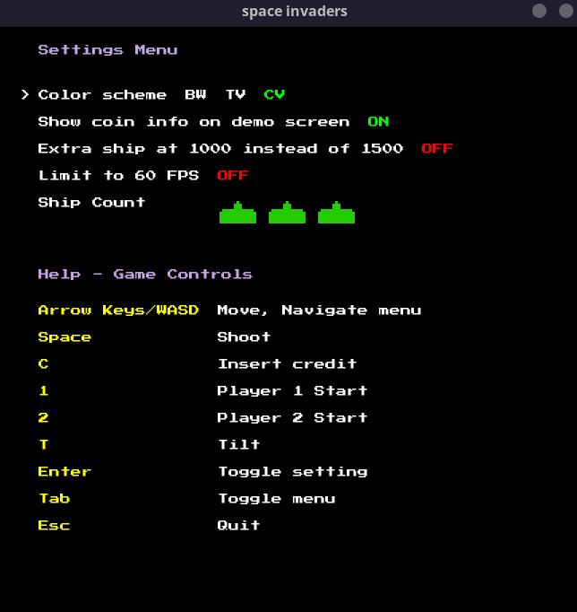
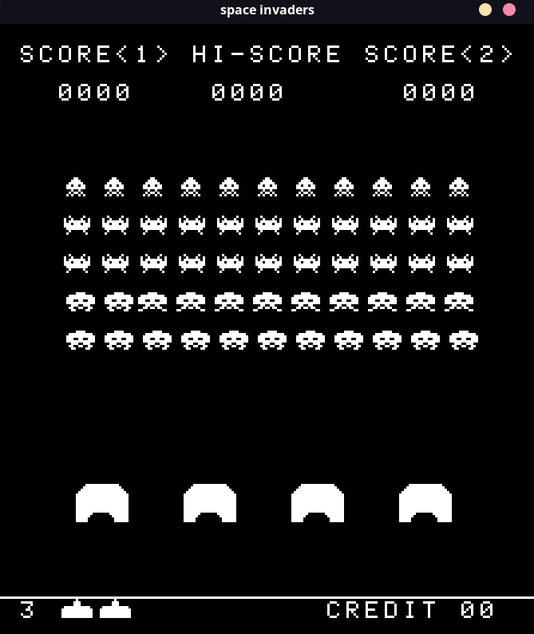
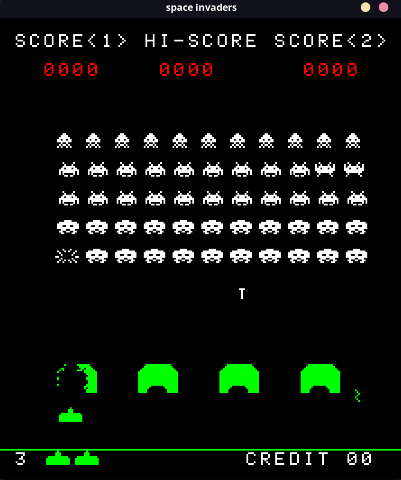
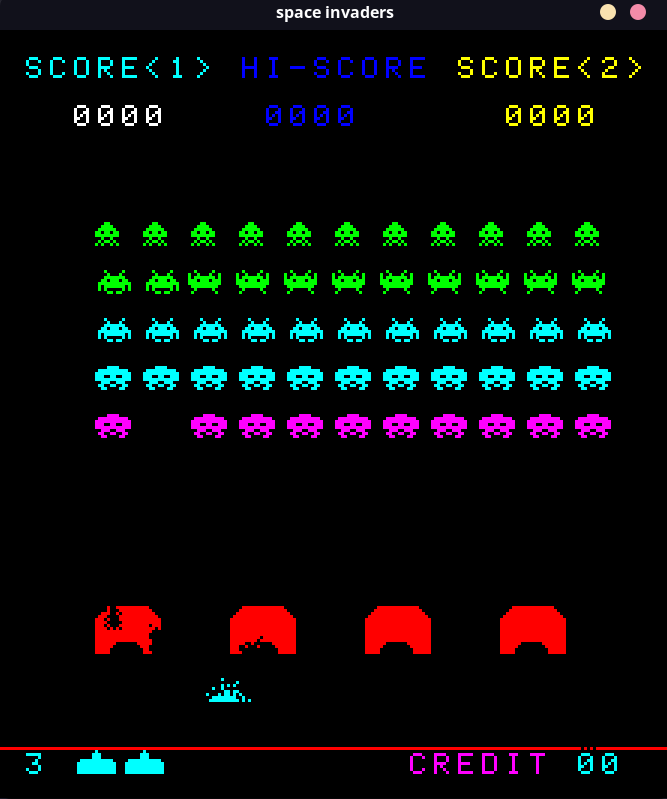

# Space Invaders
An emulation of [Space Invaders (1978)](https://www.wikiwand.com/en/Space_Invaders).

This project contains an 8080 emulator and the necessary fake hardware bits to run the original Space Invaders arcade ROM. It features:
- cycle accurate timing
- sound and input
- changing settings
- different color overlays

See [Screenshots](#screenshots) for more!

## Installation
Get a pre-built binary from the [Releases](https://github.com/braheezy/space-invaders/releases) page.

Or, install with Go:

    go install github.com/braheezy/space-invaders

Or, clone the repository and use `make`:

    git clone https://github.com/braheezy/space-invaders.git
    cd space-invaders
    make run

## Usage
Run the binary to start the game:

    space-invaders

Use the `Tab` key to toggle the Menu and Help screen.

The `cpm` command runs a pre-bundled test ROM to verify the 8080 CPU emulator. That can be executed as follows:

    > space-invaders cpm
    MICROCOSM ASSOCIATES 8080/8085 CPU DIAGNOSTIC
    VERSION 1.0  (C) 1980

    CPU IS OPERATIONAL

## Development
You need Go and the dependencies that [Ebiten engine](https://ebitengine.org/en/documents/install.html) has.

Run `make` for various commands to run.

## Screenshots

### Settings Page

### [Different Color Overlays](https://tcrf.net/Space_Invaders_(Arcade)#Color_Usage)
<table>
  <tr>
    <td align="center">
      
       Black and White Overlay
    </td>
    <td align="center">
      
       TV Overlay
    </td>
    <td align="center">
      
       CV Overlay
    </td>
  </tr>
</table>

